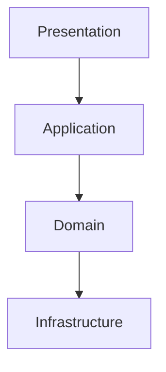
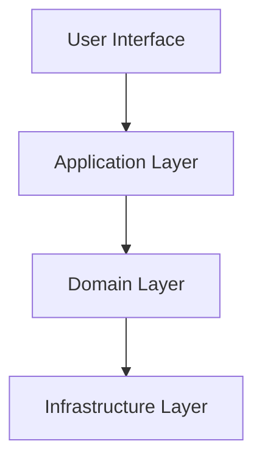

# #design Command

> Load this file when `#design` command is invoked.

---

## Purpose

Create system architecture design based on requirements analysis.

### Constraints
- Do NOT write implementation code — code is Developer's domain (`#implement`)
- Do NOT re-analyze or modify requirements — use what `#analyze` produced
- Do NOT make assumptions about missing requirements — ask for clarification

### Usage
- `#design` - Create architecture design
- `#design --plan` - Create design with implementation timeline

### Prerequisites
- Requirements analysis completed (`.ai-agents/workspace/project-context.yaml` requirements section exists and is non-empty)
- Active pattern selected in `config.yaml`

## Prerequisites Check

| Check | Condition | On Failure |
|-------|-----------|------------|
| Requirements exist | `.ai-agents/workspace/project-context.yaml` requirements section is non-empty | "No requirements found. Run `#analyze` first." |

---

## Execution Flow

**Step 1: Load Context**
- READ `.ai-agents/workspace/project-context.yaml`
- READ `.ai-agents/knowledge/patterns/{active}/` relevant files

**Step 2: Identify Architectural Concerns**
- Scalability requirements
- Performance requirements
- Security requirements
- Integration requirements

**Step 3: Apply Architecture Pattern**
- Map requirements to pattern concepts
- Define module boundaries
- Identify key abstractions

**Step 4: Design Module Structure**
- Define modules and their responsibilities
- Define interfaces between modules
- Define dependency direction

**Step 5: Make Technical Decisions**
- Technology selection
- Data storage strategy
- Communication patterns
- Error handling strategy

**Step 6: Document Architecture**
- UPDATE `.ai-agents/workspace/project-context.yaml` (architecture section)
- WRITE `.ai-agents/workspace/artifacts/{change-id}/design.md`
- UPDATE `.ai-agents/workspace/session.yaml` progress

---

## Output Structure

````markdown
## Architecture Design: {Feature/Module Name}

### Architecture Overview
{High-level description of the architecture approach}

### Architecture Diagram


### Module Structure
| Module | Purpose | Dependencies |
|--------|---------|--------------|
| {module} | {purpose} | {dependencies} |

### Key Components
| Component | Responsibility | Layer | File |
|-----------|---------------|-------|------|
| {component} | {responsibility} | {layer} | {file} |

### Interface Definitions
```typescript
interface I{InterfaceName} {
  // methods
}
```

### Technical Decisions (ADR)
| # | Decision | Choice | Rationale |
|---|----------|--------|-----------|
| 1 | {decision} | {choice} | {rationale} |

### Implementation Guidelines
- {guideline_1}
- {guideline_2}

### Implementation Plan (with --plan)
| Phase | Task | Dependencies | Complexity |
|-------|------|--------------|------------|
| 1 | {task} | - | {complexity} |

---
**Suggested Next Steps**:
- Review and confirm design
- `#implement` to start implementation
````

---

## Architecture Decision Record (ADR) Format

When documenting key decisions, use this format:

```markdown
## ADR-{number}: {Title}

### Status
Proposed | Accepted | Deprecated | Superseded

### Context
{Describe the context and problem statement}

### Decision
{Describe the decision made}

### Consequences
{Describe the consequences of the decision}

### Alternatives Considered
1. {Alternative 1}: {Why not chosen}
2. {Alternative 2}: {Why not chosen}
```

---

## Example

```
User: #design User Module

[Architect Mode]

## Architecture Design: User Module

### Architecture Overview
User module using DDD tactical patterns. User serves as aggregate root with authentication and profile subdomains.

### Architecture Diagram


### Module Structure
| Module | Purpose | Dependencies |
|--------|---------|--------------|
| domain/user | User aggregate and business rules | - |
| application/user | Use cases and services | domain/user |
| infrastructure/persistence | Repository implementations | domain/user |

### Key Components
| Component | Responsibility | Layer |
|-----------|---------------|-------|
| User | Aggregate root, identity management | Domain |
| UserService | Orchestration | Application |
| IUserRepository | Persistence interface | Domain |

### Technical Decisions (ADR)
| # | Decision | Choice | Rationale |
|---|----------|--------|-----------|
| 1 | Authentication | JWT | Stateless, scalable |
| 2 | Password hashing | bcrypt | Industry standard |

### Interface Definitions
```typescript
interface IUserRepository {
  findById(id: UserId): Promise<User | null>;
  findByEmail(email: Email): Promise<User | null>;
  save(user: User): Promise<void>;
}
```

### Implementation Plan (with --plan)
| Phase | Task | Dependencies | Complexity |
|-------|------|--------------|------------|
| 1 | Create domain entities | - | Medium |
| 2 | Implement repository interfaces | Phase 1 | Low |
| 3 | Create application services | Phase 1 | Medium |

---
**Suggested Next Steps**:
- Confirm design decisions
- `#implement` to start coding
```
