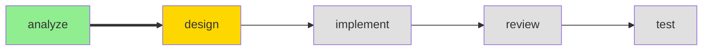

# #status Command

> Load this file when `#status` command is invoked.

---

## Purpose

Display current project and workflow status.

---

## Prerequisites Check

| Check | Condition | On Failure |
|-------|-----------|------------|
| Project initialized | `.ai-agents/workspace/session.yaml` exists and is non-empty | "Project not initialized. Run `#init` first." |

---

## Execution Flow

1. READ `.ai-agents/workspace/session.yaml`
2. READ `.ai-agents/workspace/project-context.yaml`
3. COMPILE status report

---

## Output Format

````markdown
## Project Status

### Current: {phase} Phase ({agent})



### Project: {name}
- **Type**: {type}
- **Initialized**: {date}
- **Tech Stack**: {language} / {framework}

### Progress This Session
| Phase | Status | Completed |
|-------|--------|-----------|
| Analyze | [x] Complete | 10:15 |
| Design | [~] In Progress | - |
| Implement | [ ] Pending | - |
| Review | [ ] Pending | - |
| Test | [ ] Pending | - |

### Active Change
{If active change exists}
- **Change ID**: {change_id}
- **Title**: {title}
- **Started**: {date}

---
**Suggested Next Steps**:
- {relevant_next_step}
````

---

## Workspace Health Check

After displaying workflow status, also check:
- Count artifact directories in `.ai-agents/workspace/artifacts/` (each `{change-id}/` subdirectory)
- If count > 5, append to output:

> **Workspace Notice**: {count} change artifacts found. Consider running `#cleanup` to reduce context size.
