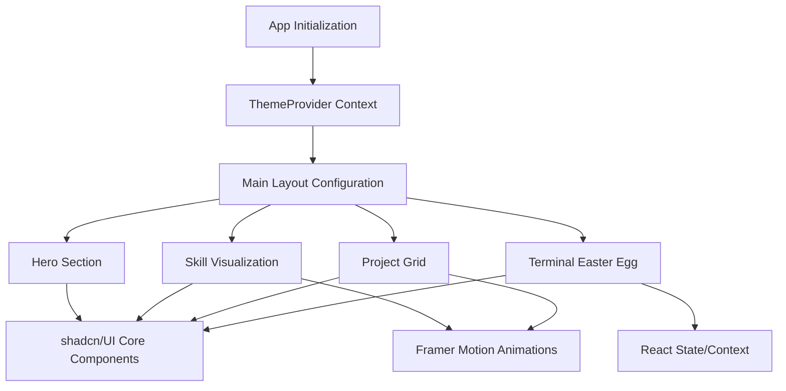

## Architecture Design: Portfolio Beautification

### Architecture Overview
The portfolio beautification will leverage the existing React 18 + Vite + Tailwind CSS stack. It will adopt a "Modern Technical Minimalist" aesthetic. To ensure consistency and speed, we will integrate `shadcn/ui` components built on top of the existing `Radix UI` primitives. State management for dark mode and the terminal easter egg will use React Context. Animations will be handled by `Framer Motion`.

### Architecture Diagram


### Module Structure
| Module | Purpose | Dependencies |
|--------|---------|--------------|
| `src/components/ui/` | Reusable UI components | `Radix UI`, `Tailwind CSS`, `framer-motion` |
| `src/components/theme/` | Theme provider and toggles | `next-themes` (or custom context) |
| `src/components/sections/`| Page sections (Hero, Projects, Skills) | `ui/*`, `framer-motion`, `personal.json` |
| `src/components/terminal/`| Interactive terminal easter egg | `React State`, `ui/card` |

### Key Components
| Component | Responsibility | Layer | File |
|-----------|---------------|-------|------|
| `ThemeProvider` | Manages dark/light mode state and DOM classes | Utility | `src/components/theme/ThemeProvider.tsx` |
| `HeroSection` | Displays focused personal info, primary CTA | Section | `src/components/sections/Hero.tsx` |
| `ProjectCard` | Interactive display of an individual project | Component | `src/components/sections/ProjectCard.tsx` |
| `SkillVisualizer` | Renders skills as progress bars or tags | Component | `src/components/sections/SkillVisualizer.tsx` |
| `TerminalCommand` | Handles input/output for the easter egg | Component | `src/components/terminal/Terminal.tsx` |

### Interface Definitions
```typescript
interface ProjectData {
  id: string;
  name: string;
  description: string;
  tags: string[];
  links: {
    preview?: string;
    source?: string;
  };
  featured: boolean;
}

interface SkillData {
  category: string;
  items: Array<{
    name: string;
    level: number; // 1-100 for visualization
    highlight?: boolean;
  }>;
}
```

### Technical Decisions (ADR)
| # | Decision | Choice | Rationale |
|---|----------|--------|-----------|
| 1 | Component Library | shadcn/ui | Seamlessly integrates with existing Radix UI and Tailwind CSS setup; highly customizable without bloat. |
| 2 | Theming Strategy | CSS Variables + Context | Standard Tailwind dark mode (`class` strategy); CSS variables allow dynamic accent colors. |
| 3 | Animation Library | Framer Motion | Already in package.json; provides declarative, performant scroll/hover animations. |
| 4 | Terminal State | Local State + Ref | The terminal is an isolated easter egg. Complex global state is unnecessary. |

### Implementation Guidelines
- Configure `tailwind.config.js` to map colors to CSS variables for theming.
- Migrate or wrap existing UI elements with `shadcn/ui` equivalents incrementally to avoid breaking the current layout.
- Use `framer-motion`'s `useInView` for scroll-triggered reveal animations to ensure performance.
- Extend `personal.json` structure slightly to support normalized skill levels required for visual charts.
